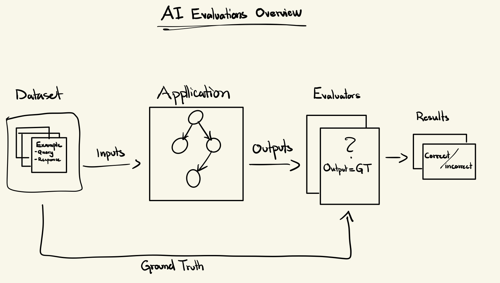
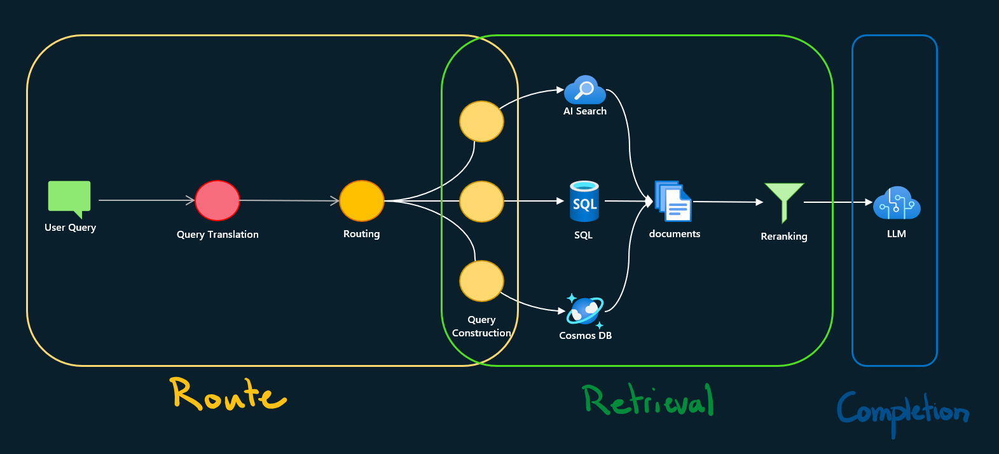

# RAG Evaluation Approach - Detailed Guide

## Why RAG Evaluation Matters

Evaluating AI-based systems, particularly those involving generative AI, presents unique challenges that require a structured evaluation framework. Different system architectures demand different evaluation approaches.

### The Challenge

When your AI assistant gives wrong answers, where's the problem?

```
User Question → [Search] → [AI Response] → Answer
                   ↓            ↓
              Problem here? Or here?
```

<!--  -->
<!-- 
### Different Systems, Different Strategies

Depending on your system architecture, you may want to deploy different evaluation strategies:

 -->

---

## **RAG Evaluation Approach**

RAG (Retrieval-Augmented Generation) systems benefit from **component-level evaluation**:
- **Retrieval Quality**: Assessing whether the system retrieves the most relevant documents
- **Generation Quality**: Evaluating if the system generates accurate responses given the retrieved context


By testing each component separately, we can identify exactly where problems occur.

---

## **Synthetic Data Generation Strategy**

This repository addresses the challenge of **no human-labeled data** through controlled synthetic data generation.

### **Chunk-based Generation**
- Start with content chunks from your knowledge base
- For each chunk, find k=5 most similar chunks using k-NN (nearest neighbor search)
- Generate synthetic Q&A pairs with controlled parameters:
  - **`is_grounded`**: Controls if question should be answerable from the chunks
  - **`difficulty`**: Sets complexity level (Beginner, Intermediate, Advanced, Expert)
  - **`tone`**: Question style (Neutral, Friendly, Angry, etc.)
  - **`language`**: Multi-language support (English, Swedish, etc.)

### **Grounded vs Not-Grounded Questions**

**Grounded Questions** → Answer IS in the provided chunks
- Used to evaluate retrieval recall (can we find the right documents?)
- Used to evaluate generation quality (does the AI use the documents correctly?)

**Not-Grounded Questions** → Answer is NOT in the provided chunks
- Tests if the AI knows when to say "I don't know"
- Helps detect hallucination (making up answers)

---

## **Component-Level Evaluation**

### **1. Retrieval Evaluation** (Notebook 03)
- Uses **grounded questions only** (we know which document should be retrieved)
- Measures **Hit Rate** and **MRR** (Mean Reciprocal Rank)
- System should retrieve the source chunks used during generation
- Failed retrieval = search system needs improvement

**Metrics Explained:**

**Hit Rate @ k** tells you: "How often do we find the right document in the top k results?"
- **> 85%** = Good! Your search is working well ✅
- **< 70%** = Problem! You're missing too many documents ❌

**MRR (Mean Reciprocal Rank)** tells you: "How high do we rank the correct document?"
- **> 0.80** = Excellent! Right docs appear near the top ✅
- **< 0.60** = Needs work! Right docs buried too deep ❌

### **2. Generation Evaluation** (Notebook 05)
- Tests with **both grounded and not-grounded questions**
- Uses **fixed context** (no retrieval) to isolate LLM performance
- **For grounded questions**: Verify AI uses only provided context (no hallucination)
- **For not-grounded questions**: Verify AI appropriately says "I don't have that information"
- Measures **Groundedness scores** using Azure AI evaluators

**Groundedness Score** (1-5 scale) tells you if the AI is using documents correctly:

- **Grounded Questions** (answer IS in the documents)
  - **High score** = AI found and used the information correctly ✅
  - **Low score** = AI missed information or made up facts ❌

- **Not-Grounded Questions** (answer NOT in the documents)
  - **High score** = AI correctly said "I don't know" ✅
  - **Low score** = AI made up an answer (hallucination!) ❌

---

## **Note on Human-Labeled Data**

While this repository focuses on synthetic data generation, **human-labeled data remains the gold standard** for evaluation. Use synthetic data when:
- ✅ Human-labeled data is unavailable or expensive
- ✅ You need large volumes of test cases quickly
- ✅ Testing edge cases and failure modes systematically
- ✅ Initial system validation before human evaluation
- ✅ Continuous integration testing

---

## **Implementing the Evaluation Framework**

Now that we understand the theory behind RAG evaluation and our synthetic data approach, let's explore how to implement this in practice. The following notebooks provide a step-by-step guide through the entire process:

### **📊 Data Generation & Validation**
1. **Notebook 01** - Generate synthetic questions using k-NN approach
2. **Notebook 02** - Validate synthetic data quality

### **🔍 RAG System Evaluation**
3. **Notebook 03** - Evaluate retrieval performance (search quality)
4. **Notebook 04** - Generate AI responses with fixed context
5. **Notebook 05** - Evaluate generation performance (AI response quality)

---

## **What To Do With Results**

**If Search is poor (low Hit Rate):**
- Improve document chunking strategy
- Add more metadata to documents
- Tune search parameters (hybrid search weights)

**If AI responses are poor (low Groundedness):**
- Improve system prompt instructions
- Adjust how context is presented to the AI
- Consider using a more capable model

**If both are good but users still complain:**
- Generate more diverse test questions
- Check for edge cases not covered in tests
- Review actual user query patterns

---

## **The Evaluation Pipeline**

```
Step 1: Generate Synthetic Data (Notebook 01)
   ↓
   • Retrieve chunks from your knowledge base
   • Find k=5 similar chunks for each using k-NN
   • Generate grounded + not-grounded questions
   • Control parameters: difficulty, tone, language
   
Step 2: Validate Data Quality (Notebook 02)
   ↓
   • Check length distributions
   • Verify category balance
   • Statistical validation
   
Step 3: Evaluate Retrieval (Notebook 03)
   ↓
   • Use grounded questions only
   • Measure Hit Rate @ k and MRR
   • Identify search issues
   
Step 4: Generate AI Responses (Notebook 04)
   ↓
   • Use fixed context (no retrieval)
   • Generate responses for all questions
   • Isolate LLM performance
   
Step 5: Evaluate Generation (Notebook 05)
   ↓
   • Score groundedness for both question types
   • Identify hallucination patterns
   • Measure LLM quality
```

---

## **Key Terminology**

- **RAG** = Retrieval-Augmented Generation (search + AI answer)
- **Hit Rate** = How often we find the right document
- **MRR** = How highly we rank the right document  
- **Groundedness** = How well AI sticks to provided documents
- **Synthetic Data** = Computer-generated test questions
- **k-NN** = k-Nearest Neighbors (finding similar items)
- **Grounded** = Answer exists in the provided context
- **Not-Grounded** = Answer requires information not in context
- **Hallucination** = AI making up information not in the documents

---

## **Getting Started**

Ready to start evaluating your RAG system? Head back to the [README](../README.md) for setup instructions, then begin with [Notebook 01](../01_generate_data.ipynb).
